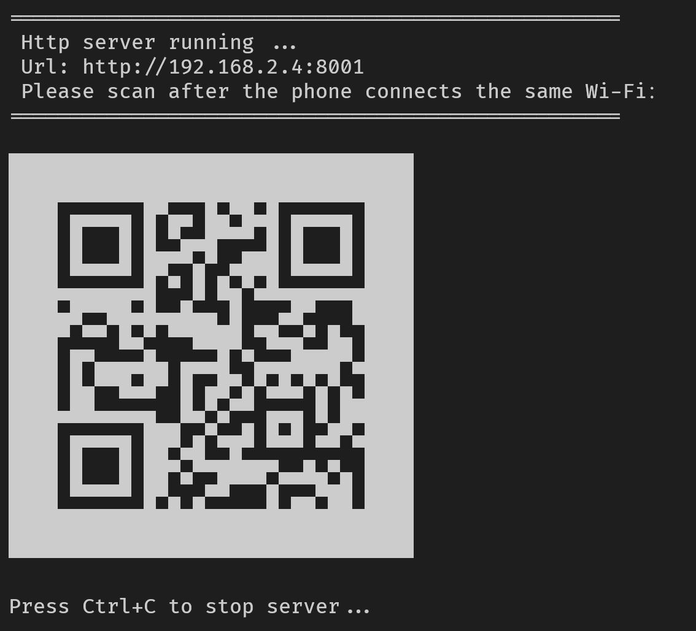

# What is qrhttp

qrhttp is http.server like server with an QR code in terminal so that you can scan with mobile easily


# Install

```bash
pip install qrhttp
```

# Usage

```bash
python -m qrhttp.cli 8001
```

or 

```bash
qrhttp 8001
```

# Screenshot

